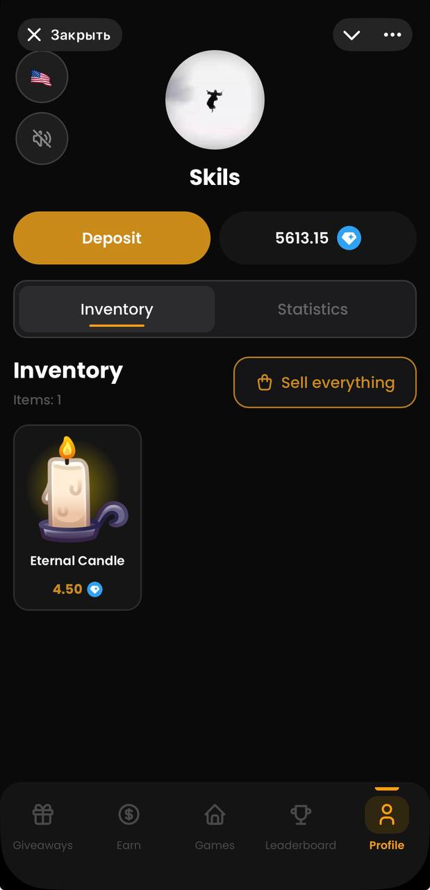
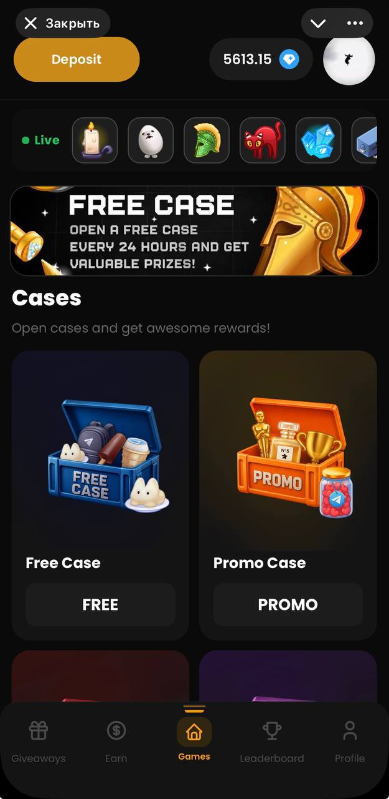
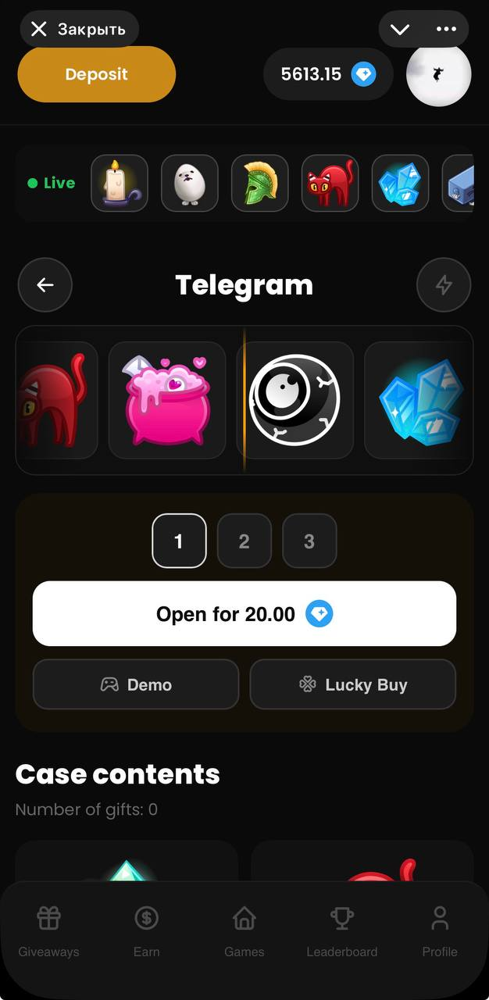
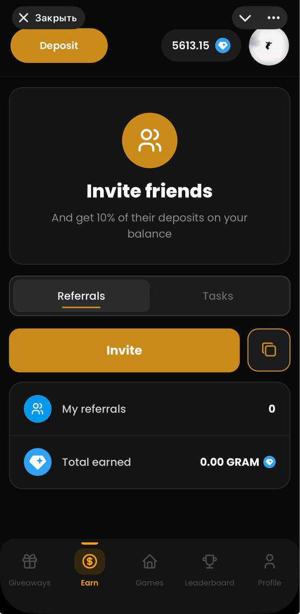
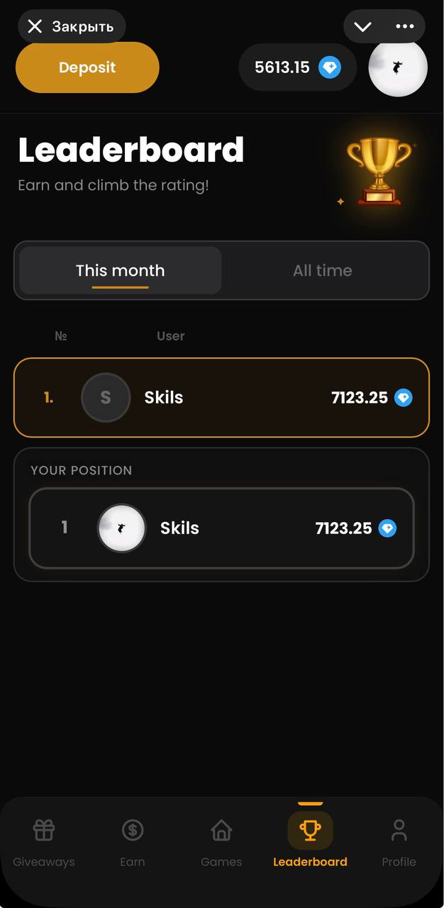

**BlazeGift**

A Telegram Mini App featuring a case-opening system where users win NFT gifts and withdraw them to their accounts. Built with a Django backend, an aiogram 3 bot, and a Telegram Mini App frontend.

>⚠️ Educational/demonstration project. Not a financial product; no real-world payouts are made.

>I worked on the backend
<br>
<br>

**Screenshots**
<table>
  <tr>
    <td></td>
    <td></td>
    <td></td>
    <td></td>
    <td></td>
  </tr>
</table>
<br>
<br>

**Features**

🎰 Cases — opening mechanism with weighted random prize distribution (RNG via 'secrets.SystemRandom'; fair win weights configured in the admin panel)<br>
🍀 Lucky Mode — a chance to obtain an item with a "reduced" contribution value (similar to "risk mode")<br>
🆓 Free Case — available every 24 hours in exchange for subscribing to the channel and forwarding a message to friends<br>
🎟 Promo Codes — single-use or multi-use codes with activation limits<br>
👥 Referral System — 10% commission on deposits made by referred users<br>
🏆 Leaderboard — monthly and all-time rankings<br>
💼 Inventory — sell items back for balance or withdraw them as an NFT gift<br>
🤖 Telegram Bot — welcome message, admin panel (broadcasts to all users), and withdrawal request approval/rejection directly within the chat<br>
🌍 Multilingual Support (RU/EN)<br>
<br>
<br>

**Stack**

Backend: Django 6, Django ORM, SQLite;<br>
Bot: aiogram 3 (async), FSM for broadcast workflows;<br>
Frontend: Telegram Mini App (Vanilla JS, no frameworks), CSS;<br>
Other: Telegram Bot API (subscription verification, prepared inline messages).<br>
<br>
<br>
**Installation and Launch (Bash)**
<br>
1. Clone the repository and install dependencies:
```
git clone https://github.com/14skilsscript88/casino-pet-project.git
cd BlazeGift
python -m venv .venv && source .venv/bin/activate
pip install -r requirements.txt
```
<br>

2. Create a .env file in the project root (blaze_gift/.env):
```
SECRET_KEY=django-insecure-change-me
DEBUG=True
MAIN_BOT_TOKEN=your_bot_token
MAIN_BOT_USERNAME=your_bot_username
CHANNEL_ID=-100xxxxxxxxxx
CHAT_ID=-100xxxxxxxxxx
SITE_DOMAIN=your-domain.example.com
```
<br>

3. Create a superuser:
```
python manage.py createsuperuser
```
<br>

4. Start the server and the bot (in two terminals):
```
python manage.py runserver
python manage.py bot
```
<br>

5. To test the Mini App locally, you will need an external tunnel (such as ngrok or Cloudflare Tunnel); the tunnel's domain should be specified in "SITE_DOMAIN" and as the Web App URL in @BotFather.
<br>
<br>

**License**

MIT

